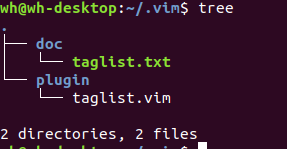

sudo apt-get install vim-scripts

### 1、 ctags
#### 1)、安装  
ctags最先是用来生成C代码的tags文件，后来扩展成可以生成各类语言的tags。例如：Python的ptags等。  
ctags插件用来查找函数、变量、宏、类、结构体等的定义。  
`sudo apt-get install ctags`   

查看是否安装成功：  
```
whereis ctags
whatis ctags
``` 

#### 2)、常用指令  
```
# 查看支持的语言    
ctags --list-launguages  
# 查看不同语言对应的tag文件扩展名  
ctags --list-maps  
# 查看可以识别的语法元素  
ctags --list-kinds  
# 对指定的语言，使能/禁用指定的kinds  
ctags --<LANG>-kinds=[+|-]kinds  
# 包含指定的扩展域  
ctags --fields=[+|-]flags  
	flags："afmikKlnsStz"  
		a -- 表示如果语法元素的类的成员的话，要标明其access(即是public的还是private的)      
		i -- 表示如果有继承，标明父类；  
		K -- 表示显示语法元素的类型的全称；  
		S -- 表示如果是函数，标明函数的signature；  
		z -- 表示在显示语法元素的类型是使用kind:type的格式  
# 生成tag文件  
ctags -R --c++-kinds=+px --fields=+iaS --extra=+q   
    参数说明：  
    	-R：即--recurse，递归遍历整个目录  
    	--c++-kinds=+px：记录类型为函数声明和前向声明的语法元素  
    	--fields=+iaS：控制记录的内容  
    	--extra=+q：让ctags额外记录一些东西。（例如：强制ctags给类的成员函数多记一行）  

```

#### 3)、tag 文件内容  
不管一次扫描多少文件，一条ctags命令把记录的内容都记到一个文件里去。  
每个语法元素对应一个tag entry，例如：

①、第一列为tag名字，即语法元素的名字，如变量名、类名等  
②、第二列为语法元素所在的文件名  
③、第三列为一条“命令”。ctags所记录的内容的一个功能就是要帮助像vi这样的编辑器快速定位到语法元素所在的文件中去。前面已经记录了语法元素所在的文件，这条命令的功能就是一旦在vi中打开语法元素所在的文件，并且执行了该“命令”后，vi的光标就能定位到语法元素在文件中的具体位置。所以该“命令”的内容一般分两种，一种是一个正则表达式的搜索命令，一种是第几行的指向命令。默认让ctags在记录时自行选择命令的种类，可以通过命令行参数来强制ctags使用某种命令  
④、最后一列为tag entry所对应的语法元素的描述，如语法元素的类型等。  

### 2、安装 Taglist  
taglist是源码浏览器，作用类似与 sourceinsight 的 Symbol 窗口(sourceinsight将当前文件中包含的头文件、宏、变量、函数、类等显示在 Symbol 串口中)。

Taglist 依赖与 ctags 插件，因此需确保 ctags 以安装。  

#### 1）、 安装方法一  
下载地址：<https://www.vim.org/scripts/script.php?script_id=273>  

解压后，将 plugin/taglist.vim 复制到 ~/.vim/plugin 目录下； 将 doc/taglist.txt 复制到 ~/.vim/doc 目录下。  
（若 ~/.vim 等目录不存在，则先手动创建，也可以直接拷贝到 **/usr/share/vim/vim80/doc 及  /usr/share/vim/vim80/plugin** 目录下）  

  

安装后，可通过在普通模式下输入`:help taglist.txt` 查看帮助文档(注意: 要想通过help taglist.txt查看，则需先执行 `:helptags ~/.vim/doc` 生成帮助标签)。  

#### 2）、安装方法二  
通过vim插件管理器 **vim-addons** 进行安装。  
```
# 安装 vim-addons  
sudo apt-get install vim-addon-manager

# 安装 taglist 插件  
vim-addons install taglist
```  
vim-addons 常见用法：  
```
# 安装插件
vim-addons install [plugin-name]  

# 查看已安装的插件状态  
vim-addons status  

# 删除插件  
vim-addons remove [plugin-name]  
```
#### 3）、taglist 配置  
```
" 设置 Taglist 窗口快捷键为 F7. 
map <F7> :TlistToggle<CR> 		" 设置普通模式下的快捷键 
imap <F7> <ESC>:TlistToggle<CR> " 设置插入模式下的快捷键
let Tlist_Auto_Open=1 			" 启动vim后自动打开taglist
let Tlist_Sort_Type="name"		" taglist窗口中按名字排序，(可选：name/order)
let Tlist_Show_One_File=1  		" 只显示当前文件的 tags
let Tlist_Exit_OnlyWindow=1  	" 若 taglist 窗口是最后一个窗口则退出vim 
"let Tlist_WinWidth=20  		" 设置 taglist 窗口宽度
"let Tlist_WinHeight=20			" 设置 taglist 窗口高度
"let Tlist_Use_Right_Window=1	" 设置 taglist 窗口显示在右侧，默认显示在左侧
"let Tlist_Use_SingleClick=1	" 单击进入对应tag, 默认为双击进入

set ut=100
```
参考：<http://vim-taglist.sourceforge.net/manual.html#'Tlist_Sort_Type'> 或 在vim中输入 `:help taglist.txt`
(注意：vimrc 中使用 `"` 进行注释)  

### 3、NERDTree  
该插件可以显示树形目录结构。类似与 Sourceinsight 右侧的文件列表窗口。  

下载地址：<https://www.vim.org/scripts/script.php?script_id=1658> 或 <https://github.com/scrooloose/nerdtree>  

解压后，将**所有文件**拷贝到 ~/.vim 目录下。  
(同样也可以直接拷贝到 **/usr/share/vim/vim80** 目录下)  

注意：若只拷贝 plugin 文件及 doc 文件，则启动时会报如下问题：  
  

NERD_tree 配置：  
```

```

### OmniCppComplete
自动补全插件。  


