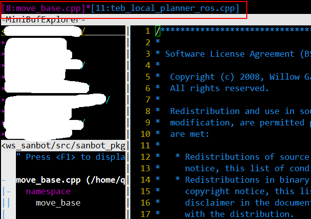

## vim 常用操作  
### 跳转
Ctrl-]    跳转到光标所在符号的定义  
Ctrl-t    回到上次跳转前的位置  

跳转时出现如下问题：“No tags file”，需修改tags的搜索方式：  
```
" 设置vim搜索tags的逻辑，该目录开始往上搜索
set tags=./tags,./TAGS,tags;~,TAGS;~
```

对于存在多个匹配的 tag（如， 在 .h 和  .cpp 中都声明或者定义的方法名，提示：“ tag 1 of 7 or more”）：  
	- :ts[elect]                 列出所有匹配的 tag；  
	- :[count]tp[revious]  跳转至前 count 个 tag 处；  
	- :[count]tn[ext]        跳转至后 count 个 tag 处。  
或者先输入g（不需要命令行模式，直接输入即可）再按ctrl+]  

### 窗口切换  

如上图，同时开启多个文件时，若想切换，只需输入：b 11 或b 8
